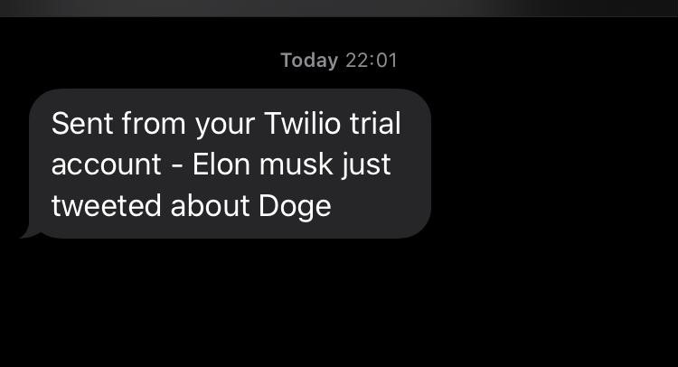

# DogeElonAlert

A Python script that will send you an text message to your phone number when Elon Musk tweets about Doge Coin !


 



# Requirements
Python 3+


## How to Install and Run the Project
1. Clone or Download the repository (Depending on whether you are using SSH or HTTPS)

```
git clone https://github.com/MohamedEl1/DogeElonAlert.git
```

2. Go to https://www.twilio.com/ and sign up for a free trial account (Needed for SMS messaging and to get the key values)

3. edit SendSMS.py file in the root folder and copy and paste the following (Your Account Sid and Auth Token from twilio.com / console):
```
account_sid = ''
auth_token = ''
```
Also enter your twilio Phone number & the phone number you want the message to be recieved to.

4. cd into the path of the folder command line then type:

```
Pip install requirements.txt
```
This should install all the necessary packages to run the script.


5. Run the script from the command line
```
Python TweetScraper.py
```

Up Next:
- Sentiment Analysis of tweets (Positive/Negative)
- Machine Learning Prediction Algrothim to Predict if Doge is contained in an image posted by Elon Musk
- Deply To heroku Cloud Platform instead of running the scraipt in the local machine


